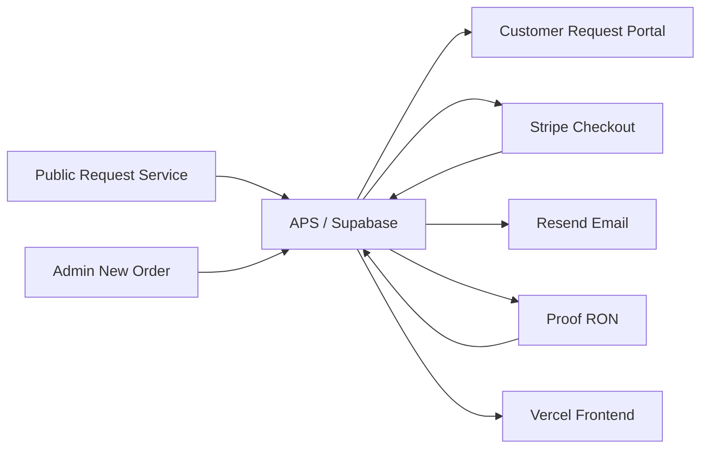

# ALIGNED PRINT & SCAN
# System Operations & Workflow Manual

Version: 1.0
Updated: 2026-08-15
Production baseline inspected: `ffa1fced0bca64cf30d558afffab0043e5624512`
Services: Remote Online Notary (RON), Mobile Notary, Print & Scan
Integrations: Supabase, Stripe, Resend, Proof, Vercel; GA4/Search Console prepared but owner configuration pending

> This is the canonical APS operating manual. **CONFIRMED IN CODE** statements are grounded in the current application, migrations, functions, or tests. Never place credentials, customer data, real request identifiers, or document names in this manual.

## Contents

1. Purpose and certification status
2. Architecture and ownership
3. Terminology
4. Customer entry and experience
5. Admin global modules
6. Request workspace
7. RON playbook
8. Mobile Notary playbook
9. Print & Scan playbook
10. Financial operations
11. Document lifecycle
12. Communications and notifications
13. Acquisition, analytics, search, and reviews
14. Troubleshooting
15. Quick checklists
16. Customer-side reference
17. Data/security matrix
18. Maintenance standard

## 1. Purpose and certification status

APS is the business system of record for customers, requests, quotes, invoices, APS-recorded payments, communications, released documents, and completion. It supports public and administrator-created orders through one service-aware workflow.

### Production certification

| Classification | Current status |
|---|---|
| **CERTIFIED** | Public intake, Admin New Order, RON readiness, Mobile and Print & Scan completion, quote/invoice/manual TEST payment, documents/release, customer portal, communications/Timeline, realtime notifications, global admin modules, archive/restore |
| **CERTIFIED** | Proof draft, exactly-one transaction, signer/source-document mapping, preparation handoff, activation, invitation/access, synchronization, and 13-stage projection through Live Notarization |
| **IMPLEMENTED / NATURALLY UNVERIFIED** | Proof completion, actual completed asset, APS retrieval, APS review, customer release, and final RON completion await the first legitimate completed notarization |
| **EXTERNAL PROVIDER BOUNDARY** | KBA, credential analysis, identity verification, live meeting, signing, certificate, seal, and provider audit/compliance records are Proof-native |

The naturally unverified Proof portion is not an APS defect. Never fabricate completion to test it.

## 2. Architecture and ownership

**CONFIRMED IN CODE:** APS is static HTML/CSS/vanilla JavaScript hosted by Vercel, using Supabase Postgres/Auth/Storage/Realtime/Edge Functions. Stripe processes card payments, Resend delivers APS email, and Proof executes RON.

### Authoritative ownership matrix

| State | Authority | APS responsibility |
|---|---|---|
| Customer/request/quote/invoice | APS | Store and enforce business workflow |
| Manual payment | APS | Reconcile to an existing invoice with duplicate protection |
| Card confirmation | Stripe event + APS reconciliation | Verify and record invoice/payment state |
| Customer communication | APS; Resend delivery | Render, send, log in Messages and Timeline |
| Proof transaction/live session | Proof; APS projection | Map one transaction and synchronize state |
| KBA/identity/signing/certificate/seal | Proof | Never collect or fabricate Proof-native identity results |
| Completed asset before retrieval | Proof | Wait/retry through authorized retrieval |
| Stored/reviewed/released document | APS | Private storage, review, explicit release, portal filtering |
| Completion gate | APS | Require service, financial, participant, and delivery facts |
| Public traffic | GA4 when configured | Anonymous public acquisition only |
| Search performance | Google Search Console | External owner-controlled reporting |

## 3. Terminology

| Term | Meaning / visibility / effect / does not mean |
|---|---|
| Customer | APS contact/profile visible to admins and applicable portal response; owns order relationships; is not automatically every signer or witness. |
| Request | One service order with its own service, workflow, financial, document, and history state; does not equal a customer profile. |
| Primary Customer | Contact responsible for the request; may differ from signer/participants. |
| Order Relationship | Link between customer and request; does not merge separate customer profiles. |
| Signer / Participant / Witness | Request-scoped structured people; visible to admins and only appropriate customer/Proof responses; not customer-directory identities by default. |
| Requested Notarial Act | Customer-selected acknowledgment, jurat, signature witnessing, certified copy, or unsure; APS records but does not choose legal certificate language. |
| Quote / Approval | APS offer and customer acceptance of scope; approval is not payment. |
| Invoice | Separate financial obligation. Primary Invoice contains known pre-work charges. Supplemental/Final Invoice contains later approved charges. |
| Payment | Money record linked to an invoice. Stripe is processor-confirmed; Manual/Offline is admin-recorded. Payment Received must not create an invoice. |
| Fulfillment | Facts proving purchased work occurred; zero balance alone is insufficient. |
| Document/Participant Readiness | Admin-maintained completion prerequisites; not document release or service completion. |
| Customer Upload | Customer-originated source file, visible in Documents You Provided; never overwritten by an output. |
| Admin/Internal Document | Supporting or audit file; admin-only unless reclassified and explicitly released under allowed rules. |
| APS Deliverable | APS-created customer output; private until eligible and released. |
| Proof Completed Document | Proof-returned notarized output; private, then APS review, then explicit release. |
| Audit/Internal Document | Operational/compliance artifact excluded from customer responses. |
| Release to Customer | APS authorization making one eligible file customer-visible; not implied by upload, Proof completion, or review. |
| Messages / Communication Log | Canonical rendered customer communication and delivery outcome. Timeline is event history; Customer Activity is filtered customer-safe history; Notifications are admin alerts. |
| Review Queue | Cross-request work requiring attention. Requests badge counts unopened requests. Notification bell shows new events; these are distinct. |
| Proof Draft / Activation / Signer Access | Existing provider transaction; consequential provider activation; legitimate signer route. None implies notarization completion. |
| APS Review | Admin confirms a retrieved completed document is suitable for release; does not release it. |
| Completion Gate | Authoritative service-aware blocker evaluation; Proof completion or payment alone cannot bypass it. |
| Archive / Protected Delete | Archive hides active work but preserves history. Protected delete is admin-only and limited to eligible test/junk records. |

## 4. Customer entry and experience

### Public Request Service

1. Contact → service → service-specific details → documents/options → scheduling → review.
2. Only active controls participate in validation.
3. Customer either uploads documents or selects a maintained no-upload reason.
4. Optional “How did you hear about APS?” stays non-blocking.
5. Server-authorized intake creates customer/request, service detail, participants/acts, documents, Timeline, and acknowledgment.
6. Failed persistence does not claim success; email failure does not erase a saved request.

### Admin New Order

Six steps collect customer, service, details, schedule/fulfillment, pricing/documents, and review. Admin may select an existing customer or create a new profile and may record a customer-reported source. Technical UTM/referrer data is never fabricated for admin-entered orders.

### Six customer portal sections

| Section | Customer sees |
|---|---|
| Overview | Current status, priority action, request summary |
| Documents | Customer uploads, released APS deliverables, released completed notarized documents in separate groups |
| Quote & Payment | Current quote, approval/change controls, invoices, balances, payment action/receipts |
| Appointment/Fulfillment | Confirmed service-appropriate schedule, location/platform, instructions, RON access only when legitimate |
| Messages | Customer-facing communications |
| Activity | Filtered, human-readable customer-safe history |

Never expose internal notes, raw event keys, provider secrets, admin blockers, audit files, unreleased deliverables, or inappropriate raw Proof identifiers.

## 5. Admin global modules

| Module | Purpose and operating notes |
|---|---|
| Requests | Search/filter/sort and open requests. Badge = never opened by admin, not Review Queue count. |
| Review Queue | Prioritized operational blockers. Open the exact request/tab; resolve state, do not merely dismiss symptoms. |
| Customers | Canonical profiles, active counts, history. Linking a request and merging profiles are separate consequential actions. |
| RON Sessions | Cross-request Proof readiness/state. Proof-native work remains in Proof. |
| Calendar | Confirmed/requested dates with service/status filtering and request navigation. |
| Payments / Invoices | Database-wide financial records. Never change a paid invoice to absorb later charges. |
| Messages / Templates | Communication history and centralized branded specifications/previews. Successful customer messages must appear in Communication Log. |
| Notifications | Authenticated operational events, deduplicated; sound follows one existing preference. |
| Settings | Maintained operational preferences/configuration. |
| New Order | Service-aware administrator request wizard. |

## 6. Eight-tab request workspace

| Tab | Use / customer effect / cautions |
|---|---|
| Overview | Read status, financial position, schedule, acquisition, review eligibility, and next action. Avoid changing status merely to change presentation. |
| Customer | Contact and identity-resolution context. Customer changes affect communication; never merge profiles casually. |
| Documents | Upload/classify/review/release. Upload is private by default; release is explicit and customer-visible. |
| Quote | Build/save current quote and line items. Saving does not send; Quote Ready communication/status is separate. |
| Payments | Inspect invoices/payments/receipts; record authorized offline payment against an existing invoice. Never create duplicate payment/invoice. |
| Messages | Preview centralized template, edit permitted body/subject, send, and optionally update status. Sending changes external state and logs Messages/Timeline. |
| Fulfillment | Appointment, service facts, RON orchestration, completion gate. Save facts before completion. |
| Timeline | Immutable operational/customer-visible events; not a substitute for Communication Log. |

## 7. RON operator playbook

| Stage | Owner | Operator action |
|---|---|---|
| 1 Business Readiness | APS/Admin | Confirm payment, appointment, participants, documents |
| 2 Create Proof Draft | APS | Create exactly one mapped draft |
| 3 Prepare Signers | APS/Admin | Validate structured signer mapping |
| 4 Prepare Documents | APS/Admin | Transfer only intended source documents |
| 5 Tag / Prepare in Proof | Admin/Proof | Open Proof in new tab; tag/prepare natively; attest in APS |
| 6 Review & Activate | Admin/Proof | Review then activate once; invitation is Proof-generated |
| 7 Signer Access | Proof/Customer | APS shows only legitimate signer-specific access |
| 8 Live Notarization | Proof | Identity/KBA, meeting, signatures, certificate, seal remain Proof-native |
| 9 Proof Completion | Proof → APS | Synchronize authoritative provider completion; do not call APS complete |
| 10 Completed Document Return | Proof/APS | Wait for asset, retrieve idempotently, store privately with provenance |
| 11 APS Review | Admin/APS | Review exact retrieved Proof document; customer still cannot see it |
| 12 Customer Release | Admin/APS | Explicitly release; portal shows Completed Notarized Documents |
| 13 APS Completion | APS | Complete only when financial/service/release gate passes |

Operator return: APS request → Continue in Proof opens new tab → APS remains open → perform Proof-native work → return to APS → state refresh/synchronization → retrieved document notification → exact Documents deep link → APS review → explicit release → customer download → completion.

## 8. Mobile Notary playbook

Request → review signer/acts/documents/location → quote → approval → primary invoice → Stripe or offline payment → confirm appointment/location/instructions → perform mobile service → record service and participant/document readiness → choose physical-only or APS-deliverable path → resolve any later invoice → complete. Proof controls are N/A. Physical-only delivery is a legitimate service-aware path, not a missing document.

## 9. Print & Scan playbook

Request → retain source documents → review print/scan/copy/paper/fulfillment specifications → quote → approval → invoice/payment → production → upload Completed Scan or other APS deliverable when applicable → pickup/courier/delivery facts → explicit customer release when portal delivery applies → complete. Source, Completed Scan, and internal supporting documents remain separate.

## 10. Financial operations

### Stripe

Customer checkout for one invoice → Stripe confirmation → idempotent APS reconciliation → invoice/payment/request totals → canonical communication + Timeline → portal receipt/status. A retry must not duplicate a payment.

### Manual/offline Payment Received

Open Payments → choose existing invoice → enter exact amount, method/source, unique external reference, and TEST indicator only for synthetic certification → record once. Duplicate external references are rejected. Partial payment leaves the invoice open. Payment Received must not create another invoice.

Invoice #1 is never rewritten after payment. Invoice #2 is used only for later approved charges. Completion requires every required non-void/non-cancelled balance to be zero or an audited allowed exception.

## 11. Document lifecycle

| Class | Created by | Customer-visible | Attachment | Completion relationship |
|---|---|---|---|---|
| Customer Upload | Customer | Yes in source group | As allowed | May satisfy document readiness |
| Admin/Internal | Admin | No by default | Internal only unless eligible | Supporting, not automatically deliverable |
| APS Deliverable | APS/Admin | Only after release | Eligible when authorized | Required when chosen delivery path says so |
| Proof Completed | Proof retrieval | Private → review → release | Never raw provider URL | Required for normal RON portal-delivery completion |
| Audit/Internal | APS/provider | No | No customer attachment | Operational/compliance only |

Portal groups: Documents You Provided; Documents from Aligned Print & Scan; Completed Notarized Documents.

## 12. Communications and notifications

Central templates cover request received, quote ready, payment reminders/receipts, appointment messages, RON ready, scan/document delivery, final invoice, completion, cancellation, general message, and the disabled-until-configured neutral review request.

Every successful customer-facing email must persist recipient, subject, template/type, direction, delivery state, timestamp, provider identifier when available, and rendered content/metadata in Messages. Timeline records the event; Customer Activity receives only customer-safe events; Notifications alert administrators. Failed sends must never display Sent.

## 13. Acquisition, analytics, search, and reviews

### Attribution

Request-level technical fields preserve canonical public landing path, referrer hostname, and normalized UTM source/medium/campaign/content. Full URLs, query strings, portal credentials, request references, document names, and PII are excluded. Customer-reported source is separate. Customer first-known source is populated once and not overwritten by later direct visits.

### UTM standard

Use lowercase values. Sources: `google`, `facebook`, `instagram`, `youtube`, `nextdoor`, `print`, `email`, `referral`. Mediums: `organic`, `social`, `email`, `qr`, `referral`. Campaigns: `business_profile`, `ron`, `mobile_notary`, `print_scan`, `general_brand`.

Examples: Google Business Profile `?utm_source=google&utm_medium=organic&utm_campaign=business_profile`; Facebook `?utm_source=facebook&utm_medium=social&utm_campaign=business_profile`; business-card QR `?utm_source=print&utm_medium=qr&utm_campaign=business_card`.

### Analytics boundary

GA4 loads only after a valid owner-supplied `G-…` Measurement ID and only on canonical public pages. Advertising signals/personalization are disabled. Events: `request_service_view`, `request_started`, `service_selected`, `request_submitted`; portal-specific quote/payment events remain excluded until an approved portal-safe measurement decision. APS database owns quote/paid/completed conversion and revenue-by-source.

### Review workflow

Eligibility = legitimate APS completion + zero outstanding required balance + no pending required customer release. State is Not Eligible, Eligible, or Sent; it never means Review Received. The centralized neutral template is intentionally inactive until the owner supplies an exact verified review URL. No satisfaction question, rating request, gating, incentives, scraping, or Yelp solicitation. Default destination will be Google after configuration; customer source does not rewrite review history.

### Search/indexing

Public canonical pages appear in `sitemap.xml`. Admin, login, request-specific portal, and document/Proof routes are excluded by robots/noindex and never included in analytics page URLs. RON language accurately states that the Texas online notary must be in Texas; the signer may be elsewhere subject to law, recipient acceptance, and Proof eligibility. Mobile and Print & Scan remain local to the supported Waxahachie/Ellis County area without invented offices.

## 14. Troubleshooting

| Symptom | Likely state / where to check | Safe next action / do not force |
|---|---|---|
| Customer cannot submit | Active-step validation, hidden required control, document/no-upload branch, function response | Reproduce service/signer/file switching; never weaken active validation |
| Customer/admin upload fails | File size/type, Storage, request_files persistence, function logs | Retry authorized upload; do not insert fake file metadata |
| Request Received email missing | Request may exist; Messages/function log | Confirm persistence first; resend only controlled/synthetic or with approval |
| Sent communication absent from Messages | Canonical send path bypass/persistence failure | Inspect provider result and messages row; Timeline alone is insufficient |
| Quote not saved/approval fails | Current quote/items/status | Save first; avoid duplicate approval/invoice |
| Invoice/payment mismatch | Invoices and linked payments | Reconcile existing invoice; never create another payment to fix display |
| Duplicate payment reference | Idempotency rejection | Verify existing payment; use genuinely unique reference only for new money |
| Possible existing customer | Review Queue/Customer tab | Link only when identity is established; otherwise Keep as New Customer |
| Release blocked/customer cannot see file | Classification, review, eligibility, customer_visible | Satisfy review/release prerequisites; never bypass RLS |
| Completion blocked | Fulfillment facts, invoices, participants, documents, release | Follow exact blocker; exception only when legitimate and audited |
| Proof draft blocked | Payment/appointment/signers/documents | Resolve business readiness; never create an uncorrelated transaction |
| Signer mapping rejected | Structured legal name/email uniqueness | Correct synthetic/authorized data; do not bypass provider rules |
| Invitation/access unavailable | Activation and signer access projection | Sync existing transaction; never duplicate activation/invitation |
| Proof in progress | Live Notarization current | Complete Proof-native work in Proof; return to APS |
| Proof complete/file unavailable | Normal provider timing gap | Wait or safe Sync; do not claim Ready for Review |
| Retrieval needs attention | Provider asset exists but secure retrieval failed | Use existing idempotent retry; never expose error to customer |
| Realtime alert missing | Auth/session/subscription/notification row | Refresh read-only state; do not create duplicate event |
| Archive/restore | Visibility lifecycle | Use archive/restore; preserve history |
| Protected deletion | Non-test/protected dependencies | Archive instead; never force-delete legitimate records |

## 15. Quick checklists

- **New RON:** customer → signers/acts/witnesses → documents → quote/payment → appointment → Proof readiness.
- **New Mobile:** customer → signers/acts/location → quote/payment → appointment → fulfillment facts → completion.
- **New Print & Scan:** source/specifications → quote/payment → production → deliverable/release or physical path → completion.
- **Payment Received:** choose existing invoice → exact amount/method/reference → confirm no duplicate → verify Messages/Timeline/totals.
- **Customer Upload:** verify provenance/request → review readiness → never relabel source as deliverable.
- **Quote Approved:** verify Invoice #1 once → payment action → no status-only invoice creation.
- **Return from Proof:** keep APS tab → synchronize → wait for authoritative completion/asset.
- **Completed Document:** exact notification → Documents → verify Proof provenance/private → APS review → explicit release.
- **Request won’t complete:** read blockers → invoices → service facts → document/participant/readiness → release path.
- **Archive:** confirm target → archive → verify hidden from active → restore only when needed.

## 16. What the customer sees

Under Review: acknowledgment and request summary. Quote Ready/Awaiting Approval: itemized quote and approval/change action. Awaiting Payment: legitimate invoice/checkout. Payment Received: recorded balance and next scheduling/fulfillment step. Appointment Confirmed: service-appropriate details; RON access only when legitimate. Fulfillment: released documents and customer-safe updates. Completed: final status and only released deliverables. At no stage does the customer see internal blockers, unreleased files, provider secrets, or raw audit events.

## 17. Data/security matrix

| Data class | Stored/processor | Customer | Admin | Analytics eligible | Release required |
|---|---|---:|---:|---:|---:|
| Contact/request/signer | Supabase; Proof receives mapped signer | Scoped | Yes | No | N/A |
| Customer upload | Private Supabase Storage | Own source | Yes | No | Already customer-originated |
| APS/Proof deliverable | Private Supabase Storage; Proof before retrieval | Only released | Yes | No | Yes |
| Audit/internal | Supabase/Proof | No | Authorized | No | Never |
| Payment metadata | APS/Stripe | Scoped | Yes | No GA4 | N/A |
| Messages/Timeline | APS/Resend | Filtered | Yes | No | N/A |
| Attribution | APS; GA4 aggregate when configured | No operational need | Yes | Normalized only | N/A |
| Proof IDs/access | APS/Proof | Signer route only when legitimate | Authorized | Never | N/A |

## 18. Maintenance standard

When a release materially changes workflow, portal/admin controls, finance, documents, templates, Proof, analytics, reviews, or security boundaries, update this manual in the same release or immediately afterward. Validate claims against current code and production; retain the evidence labels **CONFIRMED IN CODE**, **CONFIRMED IN DOCUMENTATION**, **HISTORICAL OR POSSIBLY OUTDATED**, and **UNKNOWN / OWNER CONFIRMATION REQUIRED**.
