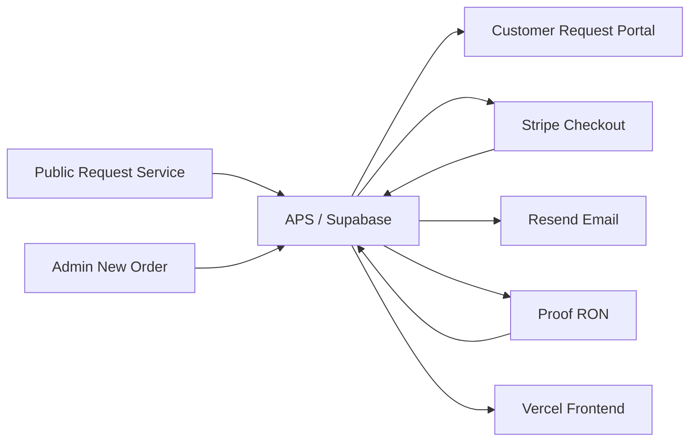

# ALIGNED PRINT & SCAN
# Operations, Policies & Standard Operating Procedures Manual

Version: 2.1
Updated: 2026-08-15
Production baseline inspected: PR #52 merge `c15c0b967a8a946ee18bf147d5fb391e536e351c`
Services: Remote Online Notary (RON), Mobile Notary, Print & Scan
Integrations: Supabase, Stripe, Resend, Proof, Vercel; Google Business Profile/review and GA4 active; Search Console verified with sitemap submitted

> This is the canonical APS operating manual. **CONFIRMED IN CODE** statements are grounded in the current application, migrations, functions, or tests. Never place credentials, customer data, real request identifiers, or document names in this manual.

## Contents

- [Part I — Foundation](#part-i--foundation)
- [Part II — Customer lifecycle](#part-ii--customer-lifecycle)
- [Part III — Admin dashboard](#part-iii--admin-dashboard)
- [Part IV — Request workspace](#part-iv--request-workspace)
- [Part V — Service playbooks](#part-v--service-playbooks)
- [Part VI — Financial operations](#part-vi--financial-operations)
- [Part VII — Changes, scheduling, cancellation, and refunds](#part-vii--changes-scheduling-cancellation-and-refunds)
- [Part VIII — Documents](#part-viii--documents)
- [Part IX — Communications](#part-ix--communications)
- [Part X — Customer support](#part-x--customer-support)
- [Part XI — Public policies](#part-xi--public-policies)
- [Part XII — Growth and analytics](#part-xii--growth-and-analytics)
- [Part XIII — Security and compliance](#part-xiii--security-and-compliance)
- [Part XIV — Troubleshooting](#part-xiv--troubleshooting)
- [Part XV — Quick reference](#part-xv--quick-reference)
- [Appendices](#appendices)

## Part I — Foundation

## 1. Purpose and certification status

APS is the business system of record for customers, requests, quotes, invoices, APS-recorded payments, communications, released documents, and completion. It supports public and administrator-created orders through one service-aware workflow.

### Production certification

| Classification | Current status |
|---|---|
| **CERTIFIED** | Public intake, Admin New Order, RON readiness, Mobile and Print & Scan completion, quote/invoice/manual TEST payment, documents/release, customer portal, communications/Timeline, realtime notifications, global admin modules, archive/restore |
| **CERTIFIED** | Proof draft, exactly-one transaction, signer/source-document mapping, preparation handoff, activation, invitation/access, synchronization, and 13-stage projection through Live Notarization |
| **IMPLEMENTED / NATURALLY UNVERIFIED** | Proof completion, actual completed asset, APS retrieval, APS review, customer release, and final RON completion await the first legitimate completed notarization |
| **EXTERNAL PROVIDER BOUNDARY** | KBA, credential analysis, identity verification, live meeting, signing, certificate, seal, and provider audit/compliance records are Proof-native |

The naturally unverified Proof portion is not an APS defect. Never fabricate completion to test it.

## 2. Architecture and ownership

**CONFIRMED IN CODE:** APS is static HTML/CSS/vanilla JavaScript hosted by Vercel, using Supabase Postgres/Auth/Storage/Realtime/Edge Functions. Stripe processes card payments, Resend delivers APS email, and Proof executes RON.

### Authoritative ownership matrix

| State | Authority | APS responsibility |
|---|---|---|
| Customer/request/quote/invoice | APS | Store and enforce business workflow |
| Manual payment | APS | Reconcile to an existing invoice with duplicate protection |
| Card confirmation | Stripe event + APS reconciliation | Verify and record invoice/payment state |
| Customer communication | APS; Resend delivery | Render, send, log in Messages and Timeline |
| Proof transaction/live session | Proof; APS projection | Map one transaction and synchronize state |
| KBA/identity/signing/certificate/seal | Proof | Never collect or fabricate Proof-native identity results |
| Completed asset before retrieval | Proof | Wait/retry through authorized retrieval |
| Stored/reviewed/released document | APS | Private storage, review, explicit release, portal filtering |
| Completion gate | APS | Require service, financial, participant, and delivery facts |
| Public traffic | Active GA4 `G-4KXRE49B0B` | Anonymous public acquisition only |
| Search performance | Verified Google Search Console URL-prefix property | Owner-controlled reporting; public canonical pages only |

## 3. Terminology

| Term | Meaning / visibility / effect / does not mean |
|---|---|
| Customer | APS contact/profile visible to admins and applicable portal response; owns order relationships; is not automatically every signer or witness. |
| Request | One service order with its own service, workflow, financial, document, and history state; does not equal a customer profile. |
| Primary Customer | Contact responsible for the request; may differ from signer/participants. |
| Order Relationship | Link between customer and request; does not merge separate customer profiles. |
| Signer / Participant / Witness | Request-scoped structured people; visible to admins and only appropriate customer/Proof responses; not customer-directory identities by default. |
| Requested Notarial Act | Customer-selected acknowledgment, jurat, signature witnessing, certified copy, or unsure; APS records but does not choose legal certificate language. |
| Quote / Approval | APS offer and customer acceptance of scope; approval is not payment. |
| Invoice | Separate financial obligation. Primary Invoice contains known pre-work charges. Supplemental/Final Invoice contains later approved charges. |
| Payment | Money record linked to an invoice. Stripe is processor-confirmed; Manual/Offline is admin-recorded. Payment Received must not create an invoice. |
| Fulfillment | Facts proving purchased work occurred; zero balance alone is insufficient. |
| Document/Participant Readiness | Admin-maintained completion prerequisites; not document release or service completion. |
| Customer Upload | Customer-originated source file, visible in Documents You Provided; never overwritten by an output. |
| Admin/Internal Document | Supporting or audit file; admin-only unless reclassified and explicitly released under allowed rules. |
| APS Deliverable | APS-created customer output; private until eligible and released. |
| Proof Completed Document | Proof-returned notarized output; private, then APS review, then explicit release. |
| Audit/Internal Document | Operational/compliance artifact excluded from customer responses. |
| Release to Customer | APS authorization making one eligible file customer-visible; not implied by upload, Proof completion, or review. |
| Messages / Communication Log | Canonical rendered customer communication and delivery outcome. Timeline is event history; Customer Activity is filtered customer-safe history; Notifications are admin alerts. |
| Review Queue | Cross-request work requiring attention. Requests badge counts unopened requests. Notification bell shows new events; these are distinct. |
| Proof Draft / Activation / Signer Access | Existing provider transaction; consequential provider activation; legitimate signer route. None implies notarization completion. |
| APS Review | Admin confirms a retrieved completed document is suitable for release; does not release it. |
| Completion Gate | Authoritative service-aware blocker evaluation; Proof completion or payment alone cannot bypass it. |
| Archive / Protected Delete | Archive hides active work but preserves history. Protected delete is admin-only and limited to eligible test/junk records. |

## Part II — Customer lifecycle

## 4. Customer entry and experience

### Public Request Service

1. Contact → service → service-specific details → documents/options → scheduling → review.
2. Only active controls participate in validation.
3. Customer either uploads documents or selects a maintained no-upload reason.
4. Optional “How did you hear about APS?” stays non-blocking.
5. Server-authorized intake creates customer/request, service detail, participants/acts, documents, Timeline, and acknowledgment.
6. Failed persistence does not claim success; email failure does not erase a saved request.

### Admin New Order

Six steps collect customer, service, details, schedule/fulfillment, pricing/documents, and review. Admin may select an existing customer or create a new profile and may record a customer-reported source. Technical UTM/referrer data is never fabricated for admin-entered orders.

### Six customer portal sections

| Section | Customer sees |
|---|---|
| Overview | Current status, priority action, request summary |
| Documents | Customer uploads, released APS deliverables, released completed notarized documents in separate groups |
| Quote & Payment | Current quote, approval/change controls, invoices, balances, payment action/receipts |
| Appointment/Fulfillment | Confirmed service-appropriate schedule, location/platform, instructions, RON access only when legitimate |
| Messages | Customer-facing communications |
| Activity | Filtered, human-readable customer-safe history |

Never expose internal notes, raw event keys, provider secrets, admin blockers, audit files, unreleased deliverables, or inappropriate raw Proof identifiers.

## Part III — Admin dashboard

## 5. Admin global modules

| Module | Purpose and operating notes |
|---|---|
| Requests | Search/filter/sort and open requests. Badge = never opened by admin, not Review Queue count. |
| Review Queue | Prioritized operational blockers. Open the exact request/tab; resolve state, do not merely dismiss symptoms. |
| Customers | Canonical profiles, active counts, history. Linking a request and merging profiles are separate consequential actions. |
| RON Sessions | Cross-request Proof readiness/state. Proof-native work remains in Proof. |
| Calendar | Confirmed/requested dates with service/status filtering and request navigation. |
| Payments / Invoices | Database-wide financial records. Never change a paid invoice to absorb later charges. |
| Messages / Templates | Communication history and centralized branded specifications/previews. Successful customer messages must appear in Communication Log. |
| Notifications | Authenticated operational events, deduplicated; sound follows one existing preference. |
| Settings | Maintained operational preferences/configuration. |
| New Order | Service-aware administrator request wizard. |

## Part IV — Request workspace

## 6. Eight-tab request workspace

| Tab | Use / customer effect / cautions |
|---|---|
| Overview | Read status, financial position, schedule, acquisition, review eligibility, and next action. Avoid changing status merely to change presentation. |
| Customer | Contact and identity-resolution context. Customer changes affect communication; never merge profiles casually. |
| Documents | Upload/classify/review/release. Upload is private by default; release is explicit and customer-visible. |
| Quote | Build/save current quote and line items. Saving does not send; Quote Ready communication/status is separate. |
| Payments | Inspect invoices/payments/receipts; record authorized offline payment against an existing invoice. Never create duplicate payment/invoice. |
| Messages | Preview centralized template, edit permitted body/subject, send, and optionally update status. Sending changes external state and logs Messages/Timeline. |
| Fulfillment | Appointment, service facts, RON orchestration, completion gate. Save facts before completion. |
| Timeline | Immutable operational/customer-visible events; not a substitute for Communication Log. |

## Part V — Service playbooks

## 7. RON operator playbook

| Stage | Owner | Operator action |
|---|---|---|
| 1 Business Readiness | APS/Admin | Confirm payment, appointment, participants, documents |
| 2 Create Proof Draft | APS | Create exactly one mapped draft |
| 3 Prepare Signers | APS/Admin | Validate structured signer mapping |
| 4 Prepare Documents | APS/Admin | Transfer only intended source documents |
| 5 Tag / Prepare in Proof | Admin/Proof | Open Proof in new tab; tag/prepare natively; attest in APS |
| 6 Review & Activate | Admin/Proof | Review then activate once; invitation is Proof-generated |
| 7 Signer Access | Proof/Customer | APS shows only legitimate signer-specific access |
| 8 Live Notarization | Proof | Identity/KBA, meeting, signatures, certificate, seal remain Proof-native |
| 9 Proof Completion | Proof → APS | Synchronize authoritative provider completion; do not call APS complete |
| 10 Completed Document Return | Proof/APS | Wait for asset, retrieve idempotently, store privately with provenance |
| 11 APS Review | Admin/APS | Review exact retrieved Proof document; customer still cannot see it |
| 12 Customer Release | Admin/APS | Explicitly release; portal shows Completed Notarized Documents |
| 13 APS Completion | APS | Complete only when financial/service/release gate passes |

Operator return: APS request → Continue in Proof opens new tab → APS remains open → perform Proof-native work → return to APS → state refresh/synchronization → retrieved document notification → exact Documents deep link → APS review → explicit release → customer download → completion.

## 8. Mobile Notary playbook

Request → review signer/acts/documents/location → quote → approval → primary invoice → Stripe or offline payment → confirm appointment/location/instructions → perform mobile service → record service and participant/document readiness → choose physical-only or APS-deliverable path → resolve any later invoice → complete. Proof controls are N/A. Physical-only delivery is a legitimate service-aware path, not a missing document.

## 9. Print & Scan playbook

Request → retain source documents → review print/scan/copy/paper/fulfillment specifications → quote → approval → invoice/payment → production → upload Completed Scan or other APS deliverable when applicable → pickup/courier/delivery facts → explicit customer release when portal delivery applies → complete. Source, Completed Scan, and internal supporting documents remain separate.

## Part VI — Financial operations

## 10. Financial operations

### Stripe

Customer checkout for one invoice → Stripe confirmation → idempotent APS reconciliation → invoice/payment/request totals → canonical communication + Timeline → portal receipt/status. A retry must not duplicate a payment.

### Manual/offline Payment Received

Open Payments → choose existing invoice → enter exact amount, method/source, unique external reference, and TEST indicator only for synthetic certification → record once. Duplicate external references are rejected. Partial payment leaves the invoice open. Payment Received must not create another invoice.

Invoice #1 is never rewritten after payment. Invoice #2 is used only for later approved charges. Completion requires every required non-void/non-cancelled balance to be zero or an audited allowed exception.

## Part VIII — Documents

## 11. Document lifecycle

| Class | Created by | Customer-visible | Attachment | Completion relationship |
|---|---|---|---|---|
| Customer Upload | Customer | Yes in source group | As allowed | May satisfy document readiness |
| Admin/Internal | Admin | No by default | Internal only unless eligible | Supporting, not automatically deliverable |
| APS Deliverable | APS/Admin | Only after release | Eligible when authorized | Required when chosen delivery path says so |
| Proof Completed | Proof retrieval | Private → review → release | Never raw provider URL | Required for normal RON portal-delivery completion |
| Audit/Internal | APS/provider | No | No customer attachment | Operational/compliance only |

Portal groups: Documents You Provided; Documents from Aligned Print & Scan; Completed Notarized Documents.

## Part IX — Communications

## 12. Communications and notifications

Central templates cover request received, quote ready, payment reminders/receipts, appointment messages, RON ready, scan/document delivery, final invoice, completion, cancellation, general message, and the disabled-until-configured neutral review request.

Every successful customer-facing email must persist recipient, subject, template/type, direction, delivery state, timestamp, provider identifier when available, and rendered content/metadata in Messages. Timeline records the event; Customer Activity receives only customer-safe events; Notifications alert administrators. Failed sends must never display Sent.

## Part XII — Growth and analytics

## 13. Acquisition, analytics, search, and reviews

### Attribution

Request-level technical fields preserve canonical public landing path, referrer hostname, and normalized UTM source/medium/campaign/content. Full URLs, query strings, portal credentials, request references, document names, and PII are excluded. Customer-reported source is separate. Customer first-known source is populated once and not overwritten by later direct visits.

### UTM standard

Use lowercase values. Sources: `google`, `facebook`, `instagram`, `youtube`, `nextdoor`, `print`, `email`, `referral`. Mediums: `organic`, `social`, `email`, `qr`, `referral`. Campaigns: `business_profile`, `ron`, `mobile_notary`, `print_scan`, `general_brand`.

Examples: Google Business Profile `?utm_source=google&utm_medium=organic&utm_campaign=business_profile`; Facebook `?utm_source=facebook&utm_medium=social&utm_campaign=business_profile`; business-card QR `?utm_source=print&utm_medium=qr&utm_campaign=business_card`.

### Analytics boundary

GA4 is **ACTIVE** using the exact owner-supplied Measurement ID `G-4KXRE49B0B`. APS initializes it once on the maintained analytics paths with a sanitized canonical page location; advertising signals and personalization are disabled. Approved public events are `request_service_view`, `request_started`, `service_selected`, and `request_submitted`. Each event is session-deduplicated, contains only an allowlisted service category, and `request_submitted` fires only after the server returns a persisted request identifier. Failed submissions do not emit it. Other allowlisted events remain dormant unless an approved privacy-safe call site exists.

Never transmit customer/signer names, email, phone, address, APS request or invoice/payment references, document names, portal tokens, Proof IDs/access links, message bodies, internal notes, or sensitive query parameters. GA4 measures public traffic and approved funnel interactions. APS remains the authoritative business-conversion system for requests, quote approvals, payments, completions, revenue, service, and source relationships.

**GA4 troubleshooting:** confirm the single `gtag/js?id=G-4KXRE49B0B` request, one `js` initialization and one `config` command, then inspect the sanitized event name/service category. If an event is absent, confirm the page is maintained, the event was not already sent in the session, and the business action actually succeeded. Never bypass deduplication or add raw form/request data to diagnose analytics.

### Review workflow

The owner-confirmed Google Business Profile is `https://share.google/rBUN6hRZiTF5UZPwz`; it appears in the public footer alongside the existing social links. The owner-confirmed direct review destination is `https://g.page/r/CeY4X1XsHwJFEAI/review` and is the centralized Google review CTA destination.

Eligibility = legitimate APS completion + zero outstanding required balance + no pending required customer release. State is Not Eligible, Eligible, or Sent; it never means Review Received. The centralized neutral template is active. An administrator may send it from Request → Messages only while the request is Eligible. The canonical sender applies the maintained Google destination, uses a request/destination idempotency key, persists the rendered communication and provider result in Messages, records a dedicated Timeline event, and advances the request to Sent. A retry of an already-sent invitation repairs/returns the existing result without another provider delivery. Failed delivery remains recorded as failed and does not advance the state to Sent.

No satisfaction question, rating request, gating, incentives, scraping, or Yelp solicitation is permitted. Customer source does not rewrite review history, and clicking the Google CTA never marks Review Received.

### Search/indexing

The Google Search Console URL-prefix property `https://alignedprintscan.com/` is **VERIFIED**. Ownership uses Google’s HTML-file method through the permanent public-root file `google7bace5a38d37ffed.html`. The canonical sitemap `https://alignedprintscan.com/sitemap.xml` is **SUBMITTED**, and Search Console reported successful submission. Preserve the verification file unless later authoritative Google guidance establishes that removal is safe.

Public canonical pages appear in `sitemap.xml`. Admin, login, request-specific portal, document/Proof routes, and other private operational surfaces remain excluded by robots/noindex and are not submitted for indexing. Do not create another property, change the canonical domain, or modify DNS/mail configuration for this verified setup. RON language accurately states that the Texas online notary must be in Texas; the signer may be elsewhere subject to law, recipient acceptance, and Proof eligibility. Mobile and Print & Scan remain local to the supported Waxahachie/Ellis County area without invented offices.

**Google setup status:** GA4 ID supplied—YES; GA4 active—YES; GA4 production verified—YES; Search Console property verified—YES; sitemap submitted—YES; owner Google setup remaining—NONE.

## Part XIV — Troubleshooting

## 14. Troubleshooting

| Symptom | Likely state / where to check | Safe next action / do not force |
|---|---|---|
| Customer cannot submit | Active-step validation, hidden required control, document/no-upload branch, function response | Reproduce service/signer/file switching; never weaken active validation |
| Customer/admin upload fails | File size/type, Storage, request_files persistence, function logs | Retry authorized upload; do not insert fake file metadata |
| Request Received email missing | Request may exist; Messages/function log | Confirm persistence first; resend only controlled/synthetic or with approval |
| Sent communication absent from Messages | Canonical send path bypass/persistence failure | Inspect provider result and messages row; Timeline alone is insufficient |
| Quote not saved/approval fails | Current quote/items/status | Save first; avoid duplicate approval/invoice |
| Invoice/payment mismatch | Invoices and linked payments | Reconcile existing invoice; never create another payment to fix display |
| Duplicate payment reference | Idempotency rejection | Verify existing payment; use genuinely unique reference only for new money |
| Possible existing customer | Review Queue/Customer tab | Link only when identity is established; otherwise Keep as New Customer |
| Release blocked/customer cannot see file | Classification, review, eligibility, customer_visible | Satisfy review/release prerequisites; never bypass RLS |
| Completion blocked | Fulfillment facts, invoices, participants, documents, release | Follow exact blocker; exception only when legitimate and audited |
| Proof draft blocked | Payment/appointment/signers/documents | Resolve business readiness; never create an uncorrelated transaction |
| Signer mapping rejected | Structured legal name/email uniqueness | Correct synthetic/authorized data; do not bypass provider rules |
| Invitation/access unavailable | Activation and signer access projection | Sync existing transaction; never duplicate activation/invitation |
| Proof in progress | Live Notarization current | Complete Proof-native work in Proof; return to APS |
| Proof complete/file unavailable | Normal provider timing gap | Wait or safe Sync; do not claim Ready for Review |
| Retrieval needs attention | Provider asset exists but secure retrieval failed | Use existing idempotent retry; never expose error to customer |
| Realtime alert missing | Auth/session/subscription/notification row | Refresh read-only state; do not create duplicate event |
| Archive/restore | Visibility lifecycle | Use archive/restore; preserve history |
| Protected deletion | Non-test/protected dependencies | Archive instead; never force-delete legitimate records |

## Part XV — Quick reference

## 15. Quick checklists

- **New RON:** customer → signers/acts/witnesses → documents → quote/payment → appointment → Proof readiness.
- **New Mobile:** customer → signers/acts/location → quote/payment → appointment → fulfillment facts → completion.
- **New Print & Scan:** source/specifications → quote/payment → production → deliverable/release or physical path → completion.
- **Payment Received:** choose existing invoice → exact amount/method/reference → confirm no duplicate → verify Messages/Timeline/totals.
- **Customer Upload:** verify provenance/request → review readiness → never relabel source as deliverable.
- **Quote Approved:** verify Invoice #1 once → payment action → no status-only invoice creation.
- **Return from Proof:** keep APS tab → synchronize → wait for authoritative completion/asset.
- **Completed Document:** exact notification → Documents → verify Proof provenance/private → APS review → explicit release.
- **Request won’t complete:** read blockers → invoices → service facts → document/participant/readiness → release path.
- **Archive:** confirm target → archive → verify hidden from active → restore only when needed.

## 16. What the customer sees

Under Review: acknowledgment and request summary. Quote Ready/Awaiting Approval: itemized quote and approval/change action. Awaiting Payment: legitimate invoice/checkout. Payment Received: recorded balance and next scheduling/fulfillment step. Appointment Confirmed: service-appropriate details; RON access only when legitimate. Fulfillment: released documents and customer-safe updates. Completed: final status and only released deliverables. At no stage does the customer see internal blockers, unreleased files, provider secrets, or raw audit events.

## 17. Data/security matrix

| Data class | Stored/processor | Customer | Admin | Analytics eligible | Release required |
|---|---|---:|---:|---:|---:|
| Contact/request/signer | Supabase; Proof receives mapped signer | Scoped | Yes | No | N/A |
| Customer upload | Private Supabase Storage | Own source | Yes | No | Already customer-originated |
| APS/Proof deliverable | Private Supabase Storage; Proof before retrieval | Only released | Yes | No | Yes |
| Audit/internal | Supabase/Proof | No | Authorized | No | Never |
| Payment metadata | APS/Stripe | Scoped | Yes | No GA4 | N/A |
| Messages/Timeline | APS/Resend | Filtered | Yes | No | N/A |
| Attribution | APS; GA4 aggregate when configured | No operational need | Yes | Normalized only | N/A |
| Proof IDs/access | APS/Proof | Signer route only when legitimate | Authorized | Never | N/A |

## 18. Maintenance standard

When a release materially changes workflow, portal/admin controls, finance, documents, templates, Proof, analytics, reviews, or security boundaries, update this manual in the same release or immediately afterward. Validate claims against current code and production; retain the evidence labels **CONFIRMED IN CODE**, **CONFIRMED IN DOCUMENTATION**, **HISTORICAL OR POSSIBLY OUTDATED**, and **UNKNOWN / OWNER CONFIRMATION REQUIRED**.

## Part VII — Changes, scheduling, cancellation, and refunds

## 19. Request Changes SOP

**Purpose:** preserve the customer’s request while placing cancellation or rescheduling under administrator review.

**When to use:** a verified customer asks to cancel or proposes a new appointment. **Do not use when:** merely correcting contact information, changing a quote, or resolving a completed-service complaint.

**Procedure:** customer opens Request Changes → selects cancellation or reschedule → supplies the applicable reason/date/time → submits once. APS verifies request/email scope, persists a deduplicated action, creates customer-safe Activity and Timeline entries, and surfaces actionable work in Review Queue. Financial, service, invoice, payment, Proof, and release state remain unchanged until an administrator decides.

**Customer sees:** “Cancellation Requested” or the reschedule-review acknowledgment—not a promised refund. **Do not:** cancel, void, refund, recreate Proof, or change status solely because a request was submitted.

## 20. Appointment Scheduling and Rescheduling SOP

**Prerequisites:** correct request, current appointment/provider/dispatch/production facts, customer communication destination, and authority to change the schedule.

1. Open the request and Fulfillment.
2. Confirm service type and existing appointment.
3. Open the guided reschedule workflow.
4. Record new date/time, reason, and whether customer- or APS-requested.
5. Review the policy band: 24+ hours normally no fee; under 24 hours is discretionary; repeated changes require review.
6. Record an applied fee only through an existing disclosed charge/invoice path. A waiver requires a private internal reason.
7. Save the authoritative appointment.
8. Send the maintained reschedule communication; use Send & Update Status only if it represents the saved transition.
9. Verify Messages and Timeline.

RON retains its existing Proof mapping unless authoritative provider behavior requires otherwise. Mobile review includes dispatch/travel. Print & Scan review includes production scheduling and work already begun. Internal waiver notes never enter customer payloads.

## 21. Admin Cancellation Review SOP

**Owner:** authorized administrator. **Prerequisites:** exact request; invoice/payment/refund history; service/appointment/fulfillment/document state; Proof state for RON.

1. Open Review Queue or the request Overview/Payments action.
2. Run **Preview Cancellation**. Preview is read-only.
3. Verify request, service, appointment, current status, quote, invoices, paid/refunded/net/outstanding totals, work performed, delivery, and applicable policy band.
4. Select reason: Customer requested, APS unable to fulfill, Duplicate request, Service unavailable, or Other.
5. Record effective date and customer-facing explanation.
6. Enter only a retained amount supported by earned work, reserved capacity, approved late-cancellation amount, consumed material, or documented nonrecoverable external cost.
7. If waiving an otherwise applicable fee, enable waiver and enter the required internal reason.
8. Select no payment, refund due, Stripe refund, or externally completed offline refund as facts require.
9. Review the confirmation summary. Do not proceed if it identifies the wrong payment/invoice or exceeds the remaining refundable amount.
10. Execute once, then verify request state, refund ledger, Messages, Timeline, Review Queue, and portal.

### Cancellation decision table

| Service and stage | Normal result | Retention boundary |
|---|---|---|
| Mobile 24+ hours | cancel/reschedule without late fee | documented nonrecoverable cost only |
| Mobile 2–24 hours | administrator review; up to $25 | earned/committed work plus disclosed cost |
| Mobile under 2 hours/no-show | administrator review; up to current $50 base | committed appointment/travel; not unperformed acts |
| RON before preparation/provider cost | refund unearned APS charges | no invented Proof fee |
| RON after preparation/provider cost | stage/cost review | supported earned/nonrecoverable amount |
| RON after notarization | service-remedy review | not an ordinary cancellation |
| Print before production | generally refundable | documented nonrecoverable cost |
| Print during production | partial refund review | completed work and consumed material |
| Print completed correctly | generally nonrefundable | APS error may justify correction/remedy |
| APS unable to fulfill | refund unearned APS charges | supported external cost only; no cancellation charge |

## 22. Refund SOP

Refund is a separate immutable financial record. The original invoice and payment remain unchanged.

### Stripe refund

Use only for the exact original Stripe payment. Confirm remaining refundable amount → enter exact partial/full amount and reason → submit once → wait for Stripe’s authoritative response → verify provider refund ID/status and APS ledger → verify totals/Timeline/communication. The server uses an idempotency key; retries must return/repair the existing result. Never mark processed before provider confirmation and never place a Stripe secret in browser code.

### Manual/offline refund

APS cannot move Zelle, Cash App, cash, or other offline money. Return funds externally first. Then choose **Record Refund**, select the original payment, and record exact amount, method, issue date, unique external reference, and reason. The screen means “record a refund already issued outside APS.” Duplicate reference and over-refund attempts are rejected.

### Financial projection

Example: invoice $60; payment +$60; refund −$35; paid $60; refunded $35; net retained $25; outstanding $0. A refund does not reopen the invoice as unpaid. Existing refunds reduce remaining refundable amount.

### Customer communication

Use Refund Due before provider/external completion and Refund Processed only after authoritative completion. Approved refunds are initiated promptly; availability depends on the original method, provider, and financial institution. Every successful message belongs in Communication Log and Timeline.

## 23. No-Show, Late Cancellation, and APS-Cancelled Service

Late-cancellation amounts are not punitive. They represent legitimately reserved capacity, travel/committed service, preparation, materials, or nonrecoverable provider cost. Administrator discretion is allowed when APS has not departed, substantially prepared, or committed meaningful resources. Never expose private waiver analysis.

When APS cannot perform, refund unearned APS charges and do not retain a cancellation amount merely because APS cancelled. Preserve supported nonrecoverable external-cost facts and provide a clear customer-facing explanation.

## Part X — Customer support

## 24. Customer Support SOP

For every case: verify identity/scope → inspect the authoritative request tab and Timeline/Messages → reply through the canonical communication path → record the outcome → escalate at the maintained boundary. Do not give legal advice, choose notarial certificate language, fabricate provider state, promise a refund before review, or claim a failed send succeeded.

| Topic | Inspect | Allowed first response/action | Escalate when |
|---|---|---|---|
| Missing information | Overview/Customer/Fulfillment | request the exact missing fact | identity conflict or repeated failure |
| Missing/upload trouble | Documents and function result | validate active branch/file constraints; authorized retry | storage/RLS failure |
| Quote/change | Quote/current items | explain or revise before approval | disputed scope after work began |
| Payment/Stripe | invoice/payment/provider result | explain current totals; safe sync | dispute, provider mismatch, chargeback |
| Offline payment/refund | payment/refund ledger | record only actual external movement | unverifiable reference/amount |
| Cancellation/reschedule | action/preview/fulfillment | acknowledge review; follow guided SOP | earned/provider-cost ambiguity |
| Mobile arrival/location | appointment/location/Messages | clarify confirmed facts | safety, no-show, material dispute |
| Print production | source/specification/stage | report authoritative production state | error/remedy decision |
| Proof invitation/KBA | APS stage and Proof record | sync/open Proof; direct native identity help to Proof | provider/identity incident |
| Completed document delay | completion/asset/retrieval/review | wait or idempotent retry | persistent secure retrieval failure |
| Portal/download | scoped access/release state | verify exact link/release; safe re-auth | RLS/authorization concern |
| Complaint/correction | all history and deliverables | preserve facts; route remedy review | legal/safety/notarial misconduct |

## Part XI — Public policies

## 25. Current Terms — Operational Text

The public Terms remain the authoritative complete legal page. The following current operative text is reproduced for day-to-day use:

- Customers may request cancellation or rescheduling; submission does not itself cancel service, void an invoice, or guarantee a refund.
- Mobile requests cancelled 24 or more hours before the appointment generally have no late-cancellation amount. Between 2 and 24 hours APS may apply up to $25. Under 2 hours or no-show APS may retain up to the current $50 Mobile Appointment Base when legitimately earned or committed. Unperformed unrelated notarial work is not automatically retained.
- RON outcomes depend on actual preparation, Proof/provider cost, and whether notarization occurred. APS does not invent a fixed Proof fee. A completed notarization is handled as completion/correction/service-remedy review, not ordinary cancellation.
- Print & Scan is generally refundable before production. After production begins, completed work, consumed materials, and authorized production may be retained. Correctly completed work is generally nonrefundable unless APS authorizes a correction or remedy.
- If APS cannot perform, APS refunds unearned APS charges and considers actual nonrecoverable external costs under the disclosed circumstances.
- Original payment and invoice history remain. Partial/full refunds are separate records. Offline refunds are recorded only after funds are returned externally.
- Approved refunds are initiated promptly; appearance time depends on payment method, provider, and financial institution.

Always consult `terms.html` for the complete currently served terms, including service, payment, liability, acceptable-use, and legal provisions.

## 26. Current Privacy — Operational Text

APS stores customer/request/service data, cancellation/reschedule reasons, support and communications history, invoice/payment/refund records, provider refund identifiers, document metadata/content, and operational audit events as needed to provide and document services. APS shares only the necessary data with maintained processors/providers. Stripe processes payment details; Proof handles Proof-native identity/KBA/notarization data. APS does not claim to receive full KBA answers or credentials. Internal notes and provider error payloads are not customer portal content. See `privacy.html` for the complete current policy and rights/contact language.

## 27. Accessibility Statement — Operational Text

APS aims to provide keyboard-operable, labeled, responsive public, portal, and admin experiences with readable contrast, useful errors, and focus-managed dialogs. Only active/visible conditional form controls participate in native required validation. Report access barriers through the published support channel. See `accessibility.html` for the complete current statement.

## 28. Cancellation, Refund, and Rescheduling FAQ

- **How do I cancel?** Open Request Changes and submit Request Cancellation. APS reviews work, costs, terms, and refund eligibility before changing financial state.
- **How do I reschedule?** Propose a new date/time through Request Changes or contact APS. Availability and already committed costs may affect the result.
- **Will I receive a refund?** Unearned amounts are generally refundable; earned work, reserved capacity, consumed materials, and supported nonrecoverable costs may be retained.
- **What about a Mobile appointment?** 24+ hours normally has no late fee; 2–24 hours may be up to $25; under 2 hours/no-show may be up to the current $50 base when legitimately committed.
- **What if Proof identity verification started?** APS reviews actual stage/provider cost; identity/KBA and notarization remain Proof-native.
- **Can Print & Scan be cancelled after production starts?** Yes, but completed work/materials may be retained and only unperformed work may be refundable.
- **How long do refunds take?** APS initiates approved refunds promptly; the original method/provider/institution controls appearance time.
- **How will I know?** APS sends the maintained confirmation after authoritative processing and the portal shows the safe refund state/totals.
- **What if APS cancels?** APS refunds unearned APS charges and explains any supported external-cost handling.
- **How do I request another change?** Use Request Changes or the published support channel and include the APS reference without sending sensitive identity documents by ordinary email.

See `faq.html` for the complete current FAQ, including service, documents, payment, Proof, and delivery topics.

## Part XIII — Security and compliance

## 29. Data Handling and Access SOP

- Use least privilege and authenticated admin functions for financial/service decisions.
- Never paste credentials, access tokens, customer PII, KBA, or document contents into documentation or support notes beyond legitimate business need.
- Treat request references as identifiers, not authentication.
- Keep storage private and release only exact eligible outputs.
- Do not weaken RLS/server filtering to repair a browser symptom.
- Preserve original financial/provenance/audit records; correct through linked new records.
- Proof-native identity, signing, certificate, seal, and audit actions occur in Proof.
- Archive preserves history; protected delete is limited and is never a routine cleanup tool.

## 30. Audit and Record Expectations

Every consequential workflow must leave an authoritative business record plus appropriate Timeline history. Successful customer-facing communications also require a Communication Log row; Timeline is not a substitute. Provider retries must be idempotent. Failed provider actions remain failed/pending and must not be presented as successful.

## Appendices

## Appendix A — Complete Template Specification Standard

Every maintained template records name, purpose, trigger, recipient, automatic/manual mode, prerequisite, subject, dynamic fields, CTA/deep link, permitted attachments, Send Message versus Send & Update Status, status effect, Messages result, Timeline result, portal effect, and idempotency rule. The current catalog is in `docs/manual-source/WORKFLOW_CATALOGS.md`; synthetic previews live in `docs/email-previews/`.

## Appendix B — Status Catalog

| Family | Source of truth | Operator rule | Unsafe transition |
|---|---|---|---|
| Request | `service_requests.status` plus workflow facts | use guided business action | status-only cosmetic change |
| Invoice | invoice and line-item ledger | preserve issued/paid history | rewrite paid primary invoice |
| Payment | payment record/provider confirmation | exact invoice/idempotency | duplicate receipt/payment |
| Refund | refund ledger/provider state | exact original payment and remaining amount | negative payment/fabricated completion |
| Document | provenance/review/release columns | explicit review/release | expose by filename/UI filtering alone |
| Customer action | pending/approved/denied record | review once | irreversible public one-click cancel |
| Proof | transaction projection and provider events | sync existing mapping | fake/recreate/complete provider state |
| Review request | eligibility/sent evidence | send once when eligible | infer received from link click |

## Appendix C — Completion Gate Matrix

| Gate | RON | Mobile | Print & Scan |
|---|---|---|---|
| Financial | all required balances resolved | same | same |
| Appointment/service | Proof completion required for normal path | appointment/service facts | production/fulfillment facts |
| Participants/documents | signer/witness/document readiness | applicable people/documents | source/specifications |
| Delivery | Proof asset retrieved, reviewed, released | physical-only or eligible APS output | pickup/courier/physical or released output |
| Forbidden shortcut | activation/payment alone | payment alone | production status alone |

## Appendix D — Troubleshooting Pattern

For every incident document: **Symptom → usual meaning → authoritative screen/log → safe procedure → do not do → escalation boundary.** Never “fix” display by manufacturing a business event. Common recovery paths are: reload read-only state; synchronize an existing provider transaction; retry an idempotent authorized action; repair missing logging without resending; satisfy the exact completion/release blocker; or escalate a provider/security mismatch.

## Appendix E — Printable Quick Reference Cards

### New RON

Customer/signers/acts → source document → quote/invoice/payment → appointment → readiness → exactly-one Proof draft → prepare/tag → activate once → signer access → Proof-native notarization → sync/retrieve → APS review → release → complete.

### New Mobile

Customer/participants/acts/location → document readiness → quote/invoice/payment → confirm appointment → perform service → record physical/deliverable path → resolve later charges → complete.

### New Print & Scan

Customer/source/specifications → quote/invoice/payment → production facts → Completed Scan/output → pickup/courier/portal release → complete.

### Cancellation / Refund / Reschedule

Open exact pending action → preview → verify service stage and ledgers → apply policy with documented discretion → preserve original money/history → execute once → verify Messages/Timeline/Review Queue/portal.

### Document Release

Exact request/file → provenance/classification → review → eligibility → explicit release → Timeline → correct portal group/download.

### Completion

Read blockers → financial → service facts → people/documents → delivery/release → complete only when all applicable facts pass.

## Appendix F — Alphabetical Glossary

- **Acknowledgment:** notarial act in which a signer acknowledges execution; APS does not choose it for the customer.
- **Activation:** consequential Proof action making signer access/invitation available; not notarization.
- **Admin New Order:** authenticated six-step request creation workflow.
- **Archive:** reversible active-work hiding that preserves history.
- **Cancellation Requested:** customer action awaiting administrator review.
- **Completed Scan:** APS-produced scan output, separate from customer source.
- **Completion Gate:** service-aware authoritative blockers preventing false completion.
- **Customer Activity:** filtered customer-safe Timeline projection.
- **Customer Upload:** customer-originated source file.
- **Document Readiness:** operational prerequisite; not release.
- **Idempotency:** same business command cannot create a duplicate external/internal event.
- **Invoice:** independent amount due; not a payment.
- **KBA:** Proof-native knowledge-based identity step never collected by APS.
- **Manual Payment:** administrator record of money already received outside Stripe.
- **Messages:** canonical customer Communication Log.
- **Net Retained:** payments minus processed refunds; not outstanding balance.
- **No-Show:** missed appointment requiring guided policy review, not automatic punishment.
- **Proof:** external RON provider for identity, signing, notarization, and native records.
- **Refund:** linked financial record reducing net retained while preserving payment.
- **Release to Customer:** explicit authorization for an eligible private output.
- **Reschedule:** reviewed appointment change preserving request/provider mapping.
- **Review Queue:** actionable cross-request operational work.
- **RON Sessions:** admin projection of Proof readiness and lifecycle.
- **Send & Update Status:** communication tied to a legitimate maintained transition.
- **Send Message:** communication without authoritative status change.
- **Signer:** request-scoped participant who signs; not necessarily the customer.
- **Supplemental Invoice:** later approved charge, separate from paid primary invoice.
- **Timeline:** immutable operational event history.
- **Witness:** conditional request participant, separate from signer/customer.

## Appendix G — Back-of-Book Index Source

Acknowledgment—§3, §7, App. F; Activation—§7, §20, App. E–F; Admin New Order—§4, App. F; Analytics—§13; Archive—§5, §14, §29; Cancellation—§19, §21–23, §28; Completed Scan—§9, §11, App. E–F; Completion Gate—§7–11, App. C/E/F; Customer Activity—§4, §19, App. F; Customer Upload—§4, §11, App. F; Document Readiness—§7–11, App. F; Document Release—§11, App. E; Invoice—§10, §21–22, App. B/F; KBA—§1–2, §7, §24, App. F; Manual Payment—§10, §22, App. F; Messages—§6, §12, §19–24, App. F; No-Show—§21, §23, App. F; Payment Received—§10, §12, §15; Proof—§1–3, §7, §20–24, §29; Refund—§21–23, §28, App. B/E/F; Release to Customer—§3, §6, §11, App. E/F; Reschedule—§19–20, §28, App. E/F; Review Queue—§3, §5, §19, §21, App. F; RON Sessions—§5, §7, App. F; Send & Update Status—§6, §12, §20, App. A/F; Signer—§3, §7, App. F; Supplemental Invoice—§10, App. F; Timeline—§3, §6, §12, §19–24, App. F; Witness—§3, §7, App. F.

## Appendix H — Document Control and Change Log

| Version | Date | Baseline | Change |
|---|---|---|---|
| 1.1 | 2026-08-15 | PR #46 | Canonical system manual, Proof certification, growth/review foundation |
| 2.0 | 2026-08-15 | PR #50 / `07e4666` | Cancellation, rescheduling, Stripe/offline/partial refund SOPs; customer support; policy/FAQ operations; template/status/fulfillment/visibility catalogs; source pack; screenshot manifest; glossary/index/quick references |
| 2.1 | 2026-08-15 | GA4 activation release | Owner Measurement ID activated; single initialization, approved event taxonomy, privacy boundary, troubleshooting, and APS-versus-GA4 ownership documented |
| 2.1 | 2026-08-15 | PR #54 / Search Console owner confirmation | URL-prefix property verified by permanent HTML file; canonical sitemap submitted successfully; private indexing protections retained; owner Google setup complete |

Documentation screenshots are governed by `docs/manual-source/SCREENSHOT_MANIFEST.md`. No automatic live screenshot is accepted if the viewport may include legitimate customer PII, real financial data, portal tokens, documents, or Proof identifiers.
